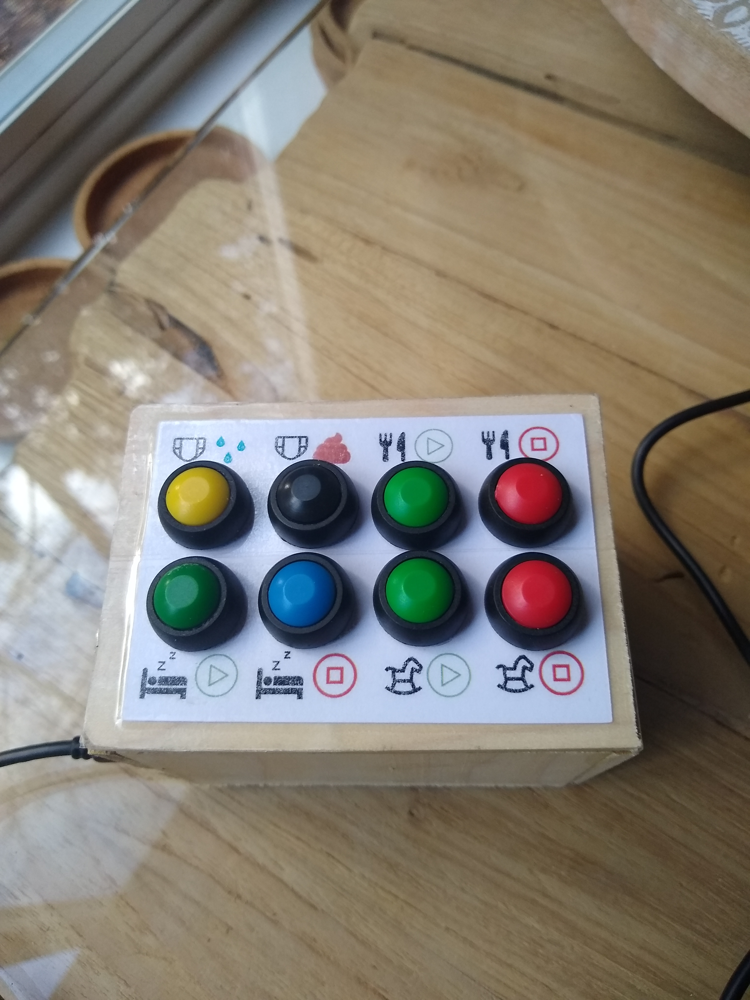
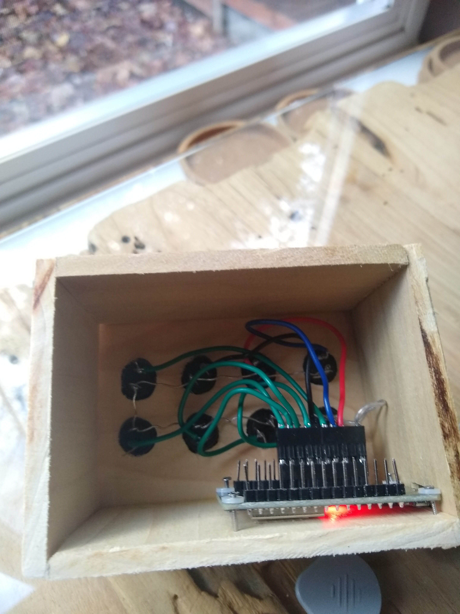

# Baby-Buddy-Keypad

inspired by https://github.com/sfgabe/OITProjects/tree/master/Baby_Buddy_Keypad I made a version of the baby buddy keypad.
Differences between this version and the original apart the physical appearance are:
- Uses ESP32 chip instead of ESP8266 because of option to do deepsleep (for battery version)
- removed light scenes support
- added support for feeding start / end
- added support for tummy time start / end
- added a version that is battery powered using two AA batteries. Since it uses deepsleep it can run for an extended time on just these batteries. Note that if you go this route you only can use single click for the buttons, so no double click/hold/etc.

## Parts
- [8 waterproof buttons](https://www.amazon.com/Waterproof-Momentary-Button-Switch-Colors/dp/B07F24Y1TB/ref=sr_1_9?crid=1TF5LGCYWZNZZ&keywords=waterproof+buttons&qid=1669590461&sprefix=waterproof+buttons%2Caps%2C154&sr=8-9).
- [a ESP32 board that provides enough RCT ports](https://www.amazon.com/gp/product/B08D5ZD528/ref=ppx_yo_dt_b_asin_title_o07_s00?ie=UTF8&psc=1).
- [Battery holder case (for battery powered version only)](https://www.amazon.com/gp/product/B09V7Z4MT7/ref=ppx_yo_dt_b_asin_title_o08_s00?ie=UTF8&psc=1).
- Home Assistant installation with ESPHome
- enclosure (I used some wood and glue)

## Assembly
- all switches are connected to VIN and to their respective GPIOs (see ESPHome YAML files)

## Programming
- Use ESPHome to load the battery powered or USB powered code
- Add your ESP device to Home Assistant once detected
- Add the Baby Buddy HA Integration if you haven't already.
- Add your own automations (you can use the one here for inspiration - for the battery powered one there are no events being fired, but a sensor will be created that returns the wake reason.).
- You'll need to figure out your baby's entity ID number/name from HA for the automations to log correctly, and decide what notes will be helpful, and change the YAML as needed. You can figure this out by making a test service call from the HA developer section and see what the YAML shows you for entity_id.

## Images

